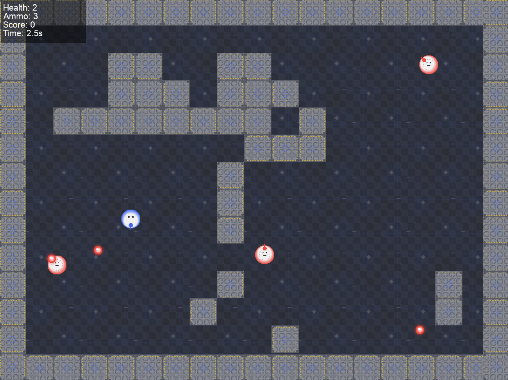

# AgentArena

A 2D shooting game framework designed as a testbed for AI agents, including manual, rule-based, and machine learning implementations.



## Overview

AgentArena is a 2D top-down action game where players navigate a grid-based arena, shoot projectiles, and avoid enemies. The framework is built to be highly modular, allowing for different agent types to control both the player and enemies.

Key features:
- Modular agent architecture (manual, rule-based, machine learning)
- Complete game environment with physics, collision detection, and event tracking
- Reinforcement learning integration with DQN implementation
- Training and evaluation tools
- Configurable game parameters
- Event logging for analysis and replay

## Installation

### Prerequisites

- Python 3.12+
- uv (recommended) or pip

### Using uv (recommended)

```bash
# Install uv if you don't have it
curl --proto '=https' --tlsv1.2 -sSf https://astral.sh/uv/install.sh | sh

# Create and activate virtual environment
uv venv
source .venv/bin/activate  # On Unix/macOS
# OR
.venv\Scripts\activate  # On Windows

# Install the project
uv pip install -e .
```

### Using pip

```bash
# Create and activate virtual environment
python -m venv venv
source venv/bin/activate  # On Unix/macOS
# OR
venv\Scripts\activate  # On Windows

# Install the project
pip install -e .
```

## Quick Start

### Playing the Game

Run the game with manual player control against random enemies:

```bash
python -m agentarena.main
```

Controls:
- Arrow keys: Move
- Space: Shoot

### Using Different Agents

```bash
# Player as manual, enemy as random (default)
python -m agentarena.main --player manual --enemy random

# Player as ML agent
python -m agentarena.main --player ml --ml-model models/your_model.pt
```

### Training a Machine Learning Agent

```bash
# Basic training run
python -m agentarena.training.train --episodes 1000 --render

# Training with advanced reward function
python -m agentarena.training.train --episodes 2000 --reward-type advanced

# Continue training from existing model
python -m agentarena.training.train --model-path models/existing_model.pt --episodes 1000
```

### Evaluating a Trained Agent

```bash
python -m agentarena.training.train --mode evaluate --model-path models/your_model.pt --episodes 10 --render
```

### Visualizing Training Results

```bash
# Visualize a single training run
python -m agentarena.training.visualize_training --files results/training_results.pkl

# Compare multiple training runs
python -m agentarena.training.visualize_training --compare --files results/run1.pkl results/run2.pkl --labels "Basic" "Advanced"
```

## Project Structure

```
agentarena/
├── src/
│   └── agentarena/
│       ├── agent/                  # Agent implementations
│       │   ├── agent.py            # Base Agent class
│       │   ├── manual_agent.py     # Human-controlled agent
│       │   ├── random_agent.py     # Random action agent
│       │   └── ml_agent.py         # Machine learning agent (DQN)
│       ├── game/                   # Game core
│       │   ├── action.py           # Action definitions
│       │   ├── entities/           # Game entities
│       │   ├── game.py             # Main game loop and logic
│       │   └── level.py            # Level generation
│       ├── training/               # ML training tools
│       │   ├── reward_functions.py # Reward definitions
│       │   ├── train.py            # Training script
│       │   └── visualize_training.py # Results visualization
│       ├── config.py               # Configuration handling
│       └── main.py                 # Entry point
├── models/                         # Saved ML models
├── results/                        # Training results
├── config.yaml                     # Game configuration
└── pyproject.toml                  # Project metadata
```

## ML Agent Implementation

The machine learning agent is implemented using Deep Q-Learning (DQN):

- **State representation**: Player position/health, enemy positions/health, bullet positions/directions
- **Action space**: 9 movement directions × 2 shooting options (18 total actions)
- **Neural network**: Fully connected layers with ReLU activations
- **Experience replay**: Store and sample previous experiences to break correlations
- **Reward functions**: Multiple options (basic, aggressive, defensive, advanced)

For details on the implementation, see the [ML Agent Guide](docs/ml_agent_guide.md).

## Configuration

Game parameters can be customized in `config.yaml`:

```yaml
# Player/enemy agent types
player_agent: manual
enemy_agent: rule_based

# Game parameters
max_enemies: 3
block_width: 64
block_height: 64
display_width: 1200
display_height: 900
fps: 30
headless: false
bullet_speed: 1200
player_speed: 600
```

## Development

### Setting up a Development Environment

```bash
# Install development dependencies
uv pip install -e ".[dev]"

# Set up pre-commit hooks
pre-commit install
```

### Code Style

The project uses:
- Black for code formatting
- Ruff for linting

To check and fix style issues:

```bash
# Format code
black src/

# Run linter
ruff check src/ --fix
```

## License

This project is licensed under the MIT License - see the LICENSE file for details.

## Acknowledgments

- Built with PyGame and PyTorch
- Inspired by classic 2D shooters and AI research environments
